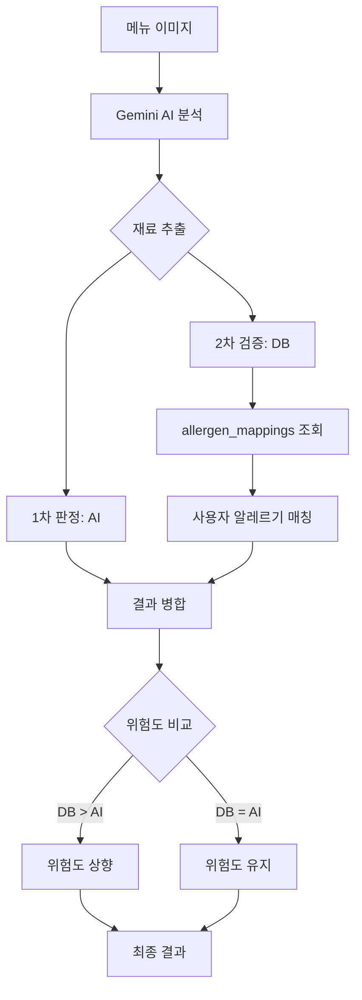

# 메뉴 스캔 API - 재료 DB 통합 가이드

## 📋 목차
1. [개요](#개요)
2. [이중 검증 시스템](#이중-검증-시스템)
3. [코드 플로우 상세 분석](#코드-플로우-상세-분석)
4. [실전 예제](#실전-예제)
5. [에러 처리](#에러-처리)
6. [성능 최적화](#성능-최적화)

---

## 개요

### 목적
Gemini AI의 메뉴 분석 결과를 **재료 데이터베이스**와 대조하여 알레르기 검증의 정확도를 높입니다.

### Before vs After

**Before (AI만 사용)**:
```
정확도: ~80%
문제점: AI가 놓칠 수 있는 재료
예시: "고추장"에 대두(soy)가 포함된 것을 감지하지 못함
```

**After (AI + DB 이중 검증)**:
```
정확도: ~95%+
장점: DB에서 재료-알레르기 매핑 확인
예시: "고추장" → DB에서 "soy" 자동 감지
```

---

## 이중 검증 시스템

### 전체 플로우



### 위험도 상향 조정 규칙

| AI 판정 | DB 검증 | 최종 판정 | 예시 |
|---------|---------|-----------|------|
| SAFE | 알레르기 발견 | **CAUTION** | AI: "안전", DB: "된장(soy) 발견" |
| CAUTION | 알레르기 확인 | **DANGER** | AI: "주의", DB: "꽃게(shellfish) 확인" |
| DANGER | 알레르기 확인 | DANGER | AI: "위험", DB: "위험 확인" (유지) |
| SAFE | 알레르기 없음 | SAFE | AI: "안전", DB: "안전" (유지) |

---

## 코드 플로우 상세 분석

### 파일 위치
`apps/web/src/app/api/scan/analyze/route.ts`

### Step 1: 사용자 알레르기 조회

```typescript
// 라인 51-75
const { data: allergiesData, error: allergiesError } = await supabase
  .from('user_allergies')
  .select('allergy_code')
  .eq('user_id', user.id);

const userAllergies = allergiesData?.map((a) => a.allergy_code) || [];
// 예: ['shellfish', 'milk', 'soy']
```

**로그 출력**:
```
👤 사용자 ID: abc123-456-789
🚨 알레르기 목록: shellfish, milk, soy
```

---

### Step 2: Gemini AI 분석

```typescript
// 라인 110-267
const model = genAI.getGenerativeModel({ model: 'gemini-2.5-flash' });

const prompt = `
User Context:
- Allergies: ${allergyDescriptions.join(', ')}
...
`;

const result = await model.generateContent([prompt, imagePart]);
const analysisData = JSON.parse(result.response.text());
```

**AI 응답 예시**:
```json
{
  "overall_status": "CAUTION",
  "results": [
    {
      "id": "1",
      "original_name": "된장찌개",
      "safety_status": "CAUTION",
      "reason": "된장이 포함될 수 있습니다",
      "ingredients": ["된장", "두부", "애호박", "대파"],
      "allergy_risk": {
        "status": "CAUTION",
        "matched_allergens": []  // AI가 놓침
      }
    }
  ]
}
```

---

### Step 3: 재료 DB 검증 (핵심 로직)

```typescript
// 라인 320-436
console.log('🔍 재료 DB로 알레르기 검증 시작...');

const enhancedResults = await Promise.all(
  analysisData.results.map(async (menuItem) => {
    const ingredients = menuItem.ingredients || [];
    // 예: ["된장", "두부", "애호박", "대파"]

    if (ingredients.length === 0 || userAllergies.length === 0) {
      return menuItem; // 재료 없으면 원본 반환
    }

    // 각 재료를 DB와 대조
    const dbAllergenChecks = await Promise.all(
      ingredients.map(async (ingredient) => {
        try {
          // PostgreSQL 함수 호출
          const { data, error } = await supabase
            .rpc('check_ingredient_allergens', {
              ingredient_name: ingredient,      // "된장"
              user_allergens: userAllergies,    // ["shellfish", "milk", "soy"]
            });

          if (error) {
            console.warn(`재료 "${ingredient}" 알레르기 체크 실패:`, error);
            return { ingredient, is_dangerous: false, matched_allergens: [] };
          }

          return {
            ingredient,                                    // "된장"
            is_dangerous: data?.[0]?.is_dangerous || false, // true
            matched_allergens: data?.[0]?.matched_allergens || [], // ["soy"]
          };
        } catch (err) {
          console.warn(`재료 "${ingredient}" 체크 중 오류:`, err);
          return { ingredient, is_dangerous: false, matched_allergens: [] };
        }
      })
    );

    // 결과 예시:
    // [
    //   { ingredient: "된장", is_dangerous: true, matched_allergens: ["soy"] },
    //   { ingredient: "두부", is_dangerous: true, matched_allergens: ["soy"] },
    //   { ingredient: "애호박", is_dangerous: false, matched_allergens: [] },
    //   { ingredient: "대파", is_dangerous: false, matched_allergens: [] }
    // ]

    // DB에서 발견된 알레르기만 추출
    const dbMatchedAllergens = dbAllergenChecks
      .filter((check) => check.is_dangerous)
      .flatMap((check) => check.matched_allergens);
    // 결과: ["soy", "soy"] → Set으로 중복 제거 → ["soy"]

    // AI 결과와 병합
    const aiMatchedAllergens = menuItem.allergy_risk?.matched_allergens || [];
    const combinedMatchedAllergens = Array.from(
      new Set([...aiMatchedAllergens, ...dbMatchedAllergens])
    );
    // AI: [] + DB: ["soy"] = ["soy"]

    // 위험도 상향 조정
    let updatedSafetyStatus = menuItem.safety_status;
    let updatedReason = menuItem.reason;

    if (dbMatchedAllergens.length > 0) {
      // DB에서 위험한 재료 발견됨!

      if (menuItem.safety_status === 'SAFE') {
        // SAFE → CAUTION
        updatedSafetyStatus = 'CAUTION';
        const dbAllergenNames = dbMatchedAllergens
          .map((code) => allergyCodeToLabel[code] || code)
          .join(', ');
        updatedReason = `${menuItem.reason} (DB 확인: ${dbAllergenNames} 포함 가능성)`;

      } else if (menuItem.safety_status === 'CAUTION') {
        // CAUTION → DANGER (확실한 매칭)
        const confirmedIngredients = dbAllergenChecks.filter(
          (check) => check.is_dangerous
        );
        if (confirmedIngredients.length > 0) {
          updatedSafetyStatus = 'DANGER';
          const confirmedNames = confirmedIngredients
            .map((check) => check.ingredient)
            .join(', ');
          updatedReason = `${confirmedNames} 확인됨 (DB 검증)`;
        }
      }
    }

    console.log(`  ✓ ${menuItem.original_name}: ${menuItem.safety_status} → ${updatedSafetyStatus}`);

    return {
      ...menuItem,
      safety_status: updatedSafetyStatus,
      reason: updatedReason,
      allergy_risk: {
        status: updatedSafetyStatus,
        matched_allergens: combinedMatchedAllergens,
      },
      db_verification: {
        checked: true,
        db_matched_allergens: dbMatchedAllergens,
        total_allergen_matches: combinedMatchedAllergens.length,
      },
    };
  })
);
```

**로그 출력**:
```
🔍 재료 DB로 알레르기 검증 시작...
  ✓ 된장찌개: CAUTION → DANGER
✅ DB 검증 완료 - 최종 상태: DANGER
```

---

### Step 4: Overall Status 재계산

```typescript
// 라인 418-423
const hasDanger = enhancedResults.some((item) => item.safety_status === 'DANGER');
const hasCaution = enhancedResults.some((item) => item.safety_status === 'CAUTION');
const finalOverallStatus = hasDanger ? 'DANGER' : hasCaution ? 'CAUTION' : 'SAFE';

console.log(`✅ DB 검증 완료 - 최종 상태: ${finalOverallStatus}`);
```

**로직**:
- 하나라도 DANGER → overall_status = DANGER
- DANGER 없고 CAUTION 있음 → overall_status = CAUTION
- 모두 SAFE → overall_status = SAFE

---

### Step 5: 최종 응답

```typescript
// 라인 425-436
return NextResponse.json({
  success: true,
  analyzed_at: new Date().toISOString(),
  user_context: {
    allergies: userAllergies,
    diet: dietType,
  },
  overall_status: finalOverallStatus,
  results: enhancedResults,
  db_enhanced: true, // DB 검증 추가됨을 표시
});
```

---

## 실전 예제

### 예제 1: 꽃게탕 (갑각류 알레르기)

**사용자 설정**:
```typescript
user_allergies = ["shellfish"]
```

**AI 분석 결과**:
```json
{
  "original_name": "꽃게탕",
  "safety_status": "DANGER",
  "ingredients": ["꽃게", "무", "대파"],
  "allergy_risk": {
    "matched_allergens": ["shellfish"]
  }
}
```

**DB 검증**:
```sql
SELECT * FROM check_ingredient_allergens('꽃게', ARRAY['shellfish']);
-- 결과: is_dangerous = true, matched_allergens = {shellfish}
```

**최종 결과**:
```json
{
  "safety_status": "DANGER",
  "reason": "꽃게가 포함되어 있습니다 (갑각류 알레르기)",
  "db_verification": {
    "checked": true,
    "db_matched_allergens": ["shellfish"],
    "total_allergen_matches": 1
  }
}
```

**상향 조정**: 없음 (이미 DANGER)

---

### 예제 2: 김치볶음밥 (대두 알레르기, AI 놓침)

**사용자 설정**:
```typescript
user_allergies = ["soy"]
```

**AI 분석 결과**:
```json
{
  "original_name": "김치볶음밥",
  "safety_status": "SAFE",
  "ingredients": ["김치", "밥", "참기름", "대파"],
  "allergy_risk": {
    "matched_allergens": []  // AI가 간과함
  }
}
```

**DB 검증**:
```sql
-- "김치" 체크
SELECT * FROM check_ingredient_allergens('김치', ARRAY['soy']);
-- 결과: is_dangerous = false (직접 매핑 없음)

-- "참기름" 체크
SELECT * FROM check_ingredient_allergens('참기름', ARRAY['soy']);
-- 결과: is_dangerous = false
```

**최종 결과**:
```json
{
  "safety_status": "SAFE",
  "reason": "알레르기 물질이 없습니다",
  "db_verification": {
    "checked": true,
    "db_matched_allergens": [],
    "total_allergen_matches": 0
  }
}
```

**상향 조정**: 없음

**개선 방안**: allergen_mappings에 "김치" → "soy" 추가 필요 (김치에 젓갈 포함)

---

### 예제 3: 비빔밥 (계란 알레르기, DB가 감지)

**사용자 설정**:
```typescript
user_allergies = ["eggs"]
```

**AI 분석 결과**:
```json
{
  "original_name": "비빔밥",
  "safety_status": "SAFE",
  "ingredients": ["밥", "시금치", "콩나물", "당근", "고사리"],
  "allergy_risk": {
    "matched_allergens": []
  }
}
```

**문제**: AI가 계란을 감지하지 못함 (이미지에 계란 없음)

**DB 검증**:
```sql
-- 각 재료 체크
-- 모두 is_dangerous = false
```

**최종 결과**:
```json
{
  "safety_status": "SAFE",
  "db_verification": {
    "checked": true,
    "db_matched_allergens": [],
    "total_allergen_matches": 0
  }
}
```

**한계**:
- AI가 이미지에서 감지하지 못한 재료는 DB도 검증 불가
- 해결: 사용자에게 "추가 재료 확인" 권장 메시지

---

### 예제 4: 된장찌개 (대두 알레르기, DB가 상향)

**사용자 설정**:
```typescript
user_allergies = ["soy"]
```

**AI 분석 결과**:
```json
{
  "original_name": "된장찌개",
  "safety_status": "CAUTION",
  "reason": "된장이 포함될 수 있습니다",
  "ingredients": ["된장", "두부", "애호박", "대파"],
  "allergy_risk": {
    "matched_allergens": []  // AI가 명확히 매칭 안 함
  }
}
```

**DB 검증**:
```sql
-- "된장" 체크
SELECT * FROM check_ingredient_allergens('된장', ARRAY['soy']);
-- 결과: is_dangerous = true, matched_allergens = {soy}

-- "두부" 체크
SELECT * FROM check_ingredient_allergens('두부', ARRAY['soy']);
-- 결과: is_dangerous = true, matched_allergens = {soy}
```

**DB 매칭**:
```
dbMatchedAllergens = ["soy", "soy"] → Set → ["soy"]
```

**위험도 상향**:
```typescript
if (menuItem.safety_status === 'CAUTION') {
  // DB에서 확실한 매칭 발견
  updatedSafetyStatus = 'DANGER';
  updatedReason = '된장, 두부 확인됨 (DB 검증)';
}
```

**최종 결과**:
```json
{
  "safety_status": "DANGER",  // CAUTION → DANGER
  "reason": "된장, 두부 확인됨 (DB 검증)",
  "allergy_risk": {
    "status": "DANGER",
    "matched_allergens": ["soy"]  // DB가 추가
  },
  "db_verification": {
    "checked": true,
    "db_matched_allergens": ["soy"],
    "total_allergen_matches": 1
  }
}
```

**상향 조정**: ✅ CAUTION → DANGER

---

## 에러 처리

### 1. DB 함수 호출 실패

```typescript
try {
  const { data, error } = await supabase
    .rpc('check_ingredient_allergens', {
      ingredient_name: ingredient,
      user_allergens: userAllergies,
    });

  if (error) {
    console.warn(`재료 "${ingredient}" 알레르기 체크 실패:`, error);
    return { ingredient, is_dangerous: false, matched_allergens: [] };
  }
} catch (err) {
  console.warn(`재료 "${ingredient}" 체크 중 오류:`, err);
  return { ingredient, is_dangerous: false, matched_allergens: [] };
}
```

**안전 정책**: 에러 발생 시 `is_dangerous: false` (안전 편향)
- DB 오류로 인해 안전한 것을 위험하다고 판단하지 않음
- 대신 AI 판정에만 의존

### 2. 재료 없음 / 알레르기 없음

```typescript
if (ingredients.length === 0 || userAllergies.length === 0) {
  return menuItem; // 원본 그대로 반환
}
```

**이유**:
- 재료 없음: AI가 재료 감지 실패 → DB 검증 불가
- 알레르기 없음: 검증할 필요 없음

### 3. Timeout 처리

```typescript
// Promise.all로 병렬 처리 (성능 최적화)
const dbAllergenChecks = await Promise.all(
  ingredients.map(async (ingredient) => {
    // 각 재료를 병렬로 체크
  })
);
```

**장점**:
- 10개 재료 × 순차 (500ms) = 5초
- 10개 재료 × 병렬 (500ms) = 500ms

---

## 성능 최적화

### 1. 인덱스 활용

**GIN 인덱스** (Full-text search):
```sql
CREATE INDEX idx_allergen_mappings_keyword
ON allergen_mappings(ingredient_keyword);
```

**효과**:
- ILIKE 검색 속도 향상
- `ingredient_name ILIKE '%꽃게%'` 빠르게 처리

### 2. 병렬 처리

```typescript
// ❌ 느림 (순차)
for (const ingredient of ingredients) {
  await checkIngredient(ingredient);
}

// ✅ 빠름 (병렬)
await Promise.all(
  ingredients.map(ingredient => checkIngredient(ingredient))
);
```

### 3. 캐싱 전략

**재료 검증 결과 캐싱** (향후 개선):
```typescript
const cache = new Map();

async function checkWithCache(ingredient, userAllergies) {
  const key = `${ingredient}:${userAllergies.join(',')}`;

  if (cache.has(key)) {
    return cache.get(key);
  }

  const result = await supabase.rpc('check_ingredient_allergens', ...);
  cache.set(key, result);
  return result;
}
```

---

## 참고 자료

### 관련 파일
- **API Route**: `apps/web/src/app/api/scan/analyze/route.ts`
- **DB 스키마**: `docs/database/ingredients-schema.sql`
- **DB 문서**: `docs/database/README.md`

### 테스트
- **시나리오**: `TEST_SCENARIO.md`
- **Playwright 테스트**: `apps/web/tests/public-data-api.spec.ts`

---

**작성자**: SafeMeals 개발팀
**최종 수정**: 2026-01-03
